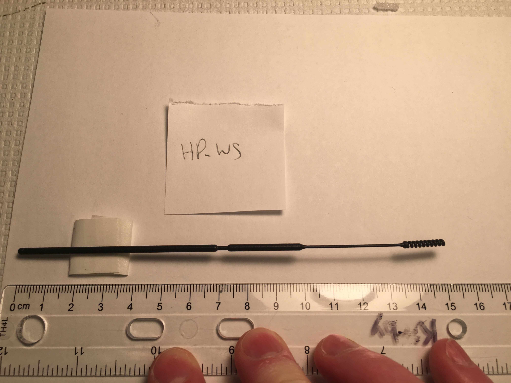
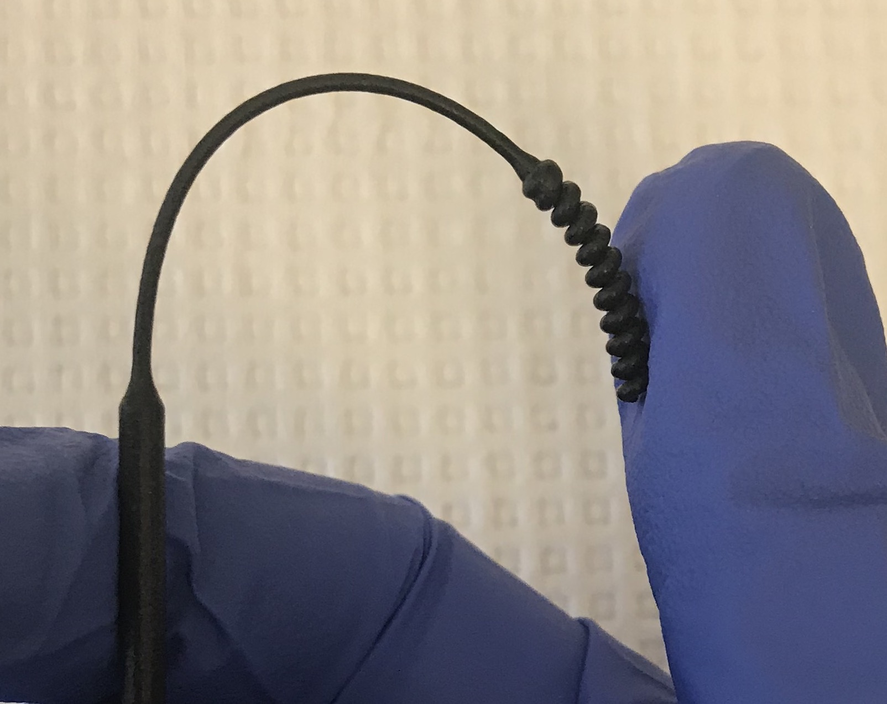
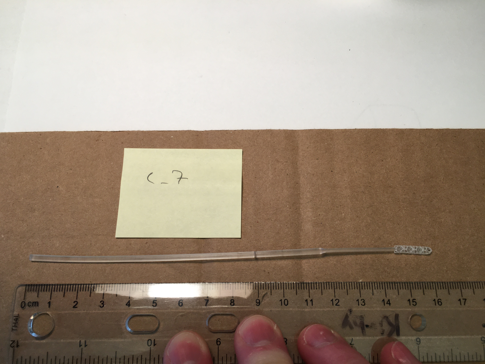

*Last modified: Thursday, May 7, 2020*

# Results summary, BIDMC

## Wednesday, May 13, 2020

Our work, detailing NP swab development and clinical validation, has now been peer reviewed and published by the <a href="https://jcm.asm.org/content/early/2020/05/11/JCM.00876-20"> Journal of Clinical Microbiology</a>.

Clinically validated swabs are now available to <a href="https://printedswabs.org/"> order</a>

## Thursday, May 7, 2020

The <a href="https://www.medrxiv.org/content/10.1101/2020.04.14.20065094v2">second version</a> of our preprint is now up on medRxiv, including results from HP, Inc (Abiogenix/Fathom).

## Monday, May 4, 2020

**Regarding viral transport media,** colleagues here at BIDMC have posted a preprint describing the <a href="https://www.medrxiv.org/content/10.1101/2020.04.29.20085514v1">large-scale, in-house production of viral transport media to support SARS-CoV-2 PCR testing in a multi-hospital healthcare network during the COVID-19 pandemic</a>. If you need to produce your own media, please see this manuscript.

## Sunday, April 19, 2020--updated Friday, April 24, 2020

<a href="https://www.medrxiv.org/content/10.1101/2020.04.14.20065094v1">The first results of our field trial are now on medRxiv</a>. (Note apparently medRxiv has been having issues.) In addition to what's in the preprint, a prototype from HP, Inc. has also passed our trial. We will be updating medRxiv as we can.

The participant information sheet we used is <a href="BIDMC_participant_information_sheet.pdf">here</a>. **Remember, approval of such a document requires approval of Your IRB.**

The raw data for Fig. 2 is <a href="fig2_data.txt">here</a>.

Contact information for manufacturers is <a href="https://printedswabs.org">here</a>.

**We continue to make our work freely available to help everyone address the crisis. If you use any of the work here, please do cite the repo and the prprint, Callahan et al. medRxiv 2020.**

## Friday, April 17, 2020

**A brief note: we have received very many requests for our results regarding FormLabs' prototypes. You can find them in <a href="np_swab_results.xlsx">this Excel spreadsheet</a>. None of the prototypes we received from FormLabs passed our Phase I testing. We deemed them too brittle. Therefore none entered our clinical trial. If you have questions about clinical evaluation of FormLabs' swabs, please contact USF/Northwell, as they are the ones with the most experience with these swabs in a clinical context and can advise.**

## Wednesday, April 15, 2020

This entry contains a short summary of progress over the past 10 days at BIDMC, one of the many groups that are working together to resolve the NP swab shortage. It will also try to address frequently-asked questions.

### Contents
- <a href="#field_trial">Field trial results</a>
- <a href="#irb">BIDMC IRB materials for reuse</a>
- <a href="#process_041520">Process update</a>

### Field trial results

About two weeks ago we began an IRB-approved field trial of select prototypes that had passed our initial phases of testing. (Please see prior updates for details of those phases.)

The main goal of the trial was to measure concordance between each prototype and a control, for which we used Copan model 501CS01, one of the FDA's approved standard (flocked) NP swabs. Participants were drawn from the pool of people clinically suspected of COVID-19 who were given appointments at BIDMC's drive-through testing facility.

Specifically, the goal was to collect a prototype as well as a control NP swab on each participant until we had 10 SARS-CoV-2-positive and SARS-CoV-2-negative controls. These were all tested on our in-house Abbott m2000s.

To date prototypes from three manufacturers have completed the trial, with others at various stages. The three are from Resolution Medical (crafted with Carbon3D technology), EnvisionTec, and Origin.io. (Note we have not tested FormLabs.) These all exhibited a high degree of concordance with the controls. Analysis of Ct values showed no statistical evidence of bias, although the numbers are small. Participants tolerated the prototypes to varying degrees.

We have written up the results and posted them to medRxiv so everyone can see details; unfortunately it is taking a bit longer to get a link from them than we wished but we will post it here.

Manufacturers are continuing to iterate on their designs.

The trial is ongoing.

### BIDMC IRB materials for reuse

To help others who want to run a trial, we have made <a href="BIDMC_IRB_key_info.pdf">relevant sections from our IRB available</a>, including <a href="BIDMC_participant_information_sheet.pdf">participant information sheet</a>. If you use them, please cite Callahan et al., medRxiv 2020 (link pending).

### Process update

Manufacturers have launched a <a href="https://printedswabs.org/">site for connecting hospitals with manufacturers</a>. To our knowledge, not all manufacturers appear there. Appearing on that site does not count as an endorsement from BIDMC.

We continue to receive many inquiries. If you are a manufacturer interested in our testing your swabs, the best thing is to send a high-resolution image and, if you can (to cut down on lead time, but unfortunately not as a guarantee we will test), send a complete description (including manufacturer; sender; manufacturing technique; detailed measurements of head, neck, breakpoint, and shaft; production volume now, in one week, and in one month), to CLS624 c/o Cody Callahan, 3 Blackfan Circle, Boston, MA 02215.

Regarding phone and email inquiries: we are happy to help as we can but please do read all the information here and below before sending an email or placing a call, as  your questions may already be answered.

## Friday, April 3, 2020

This entry contains a summary of progress over the past week at BIDMC, one of the many groups that are working together to resolve the NP swab shortage. It will also try to address frequently-asked questions.

### Contents
- <a href="#phase1">Phase I testing: expert evaluation, collection sufficiency, PCR compatibility</a>
- <a href="#phase2">Phase II testing: decontamination, packaging, volume</a>
- <a href="#phase3">Phase III testing: field trial (IRB)</a>
- <a href="#self">Self-printing</a>
- <a href="#process">Process update</a>
- <a href="#next">Next steps</a>

### Phase I testing: expert evaluation, collection sufficiency, PCR compatibility

Earlier this week we completed <a href="../BIDMC/np_swab_results.xlsx">Phase I testing</a> of over 140 materials and prototypes from approximately two dozen manufacturers and other groups.

This phase consists of three steps: (i) expert evaluation, (ii) collection sufficiency (using Gram stain of cheek swab as a proxy for the nasopharynx), (iii) compatibility with our Covid-19 PCR test (we are currently using the Abbott system).

At this point we have completed many (>5-10) iterations of prototypes with several manufacturers, at each step offering design feedback and guidance, working with their engineers, and they have been unbelievably responsive and ingenious in working with us.

### Phase II testing: decontamination, packaging, volume

As we have moved past Phase I, we considered the ability to decontaminate, with a preference for autoclaving; the ability to package singly, and to produce swabs at high volume---hundreds of thousands of units per day or more---and for low cost. This evaluation was done again through many interations with manufacturers.

These two phases resulted in our selection of four prototypes at present---from Carbon3D, EnvisionTEC, Hewlett Packard, and Origin 3D Manufacturing---for Phase III testing, a field trial under IRB (below).

#### How to interpret our selections

We have chosen the prototypes that, per our Phase I and II evaluation above, performed best.

We have chosen prototypes produced via different technologies and materials to maximize our probability of finding solutions and minimize the probability that unforeseen issues results in a future supply bottleneck (such as the one that led to this crisis). We are fortunate that our Covid and respiratory pathogen testing bandwidth at BIDMC allows for testing at scale.

The prototypes we have chosen reflect our best judgment. The Phase I data is collected and freely available to others in this directory. We recognize that others are free to reach their own conclusions and that specific requirements may differ by setting.

#### Additional prototypes

We announced that we would be testing everything received before 5 p.m. Eastern this past Monday, March 2. Mainly for bandwidth reasons we are discouraging new submissions at BIDMC. Other sites may still be accepting. We will try to facilitate connecting manufacturers with additional testing sites if we are asked.

### Phase III testing: field trial (IRB)

As mentioned above, today we began field testing under an IRB. Briefly we are collecting 10 positives and 10 negatives for control swabs and each prototype and testing concordance. We will make details available in this folder as soon as we can. We may add additional prototypes in the future. We will report results in collaboration with the manufacturers.

### Self-printing

We have received many inquiries regarding self-printing. We understand there are sites with on-site 3D printing capacity but effectively no swabs for whom this is a particularly urgent issue. While **we strongly encourage waiting to purchase from a manufacturer if at all possible**, we point those in this urgent situation to the work of Dr. Summer Decker at USF and of FormLabs, who have <a href="https://usf.box.com/s/wxmlj0r66vp8bzei6o7sur1kq1jr8o1i">made available an STL file and a readme</a>. This statement should not be read as an endorsement: the FormLabs solution was not selected for Phase III testing at BIDMC. Our Phase I evaluation of the material for this solution, as for all others we tested, is in the Excel spreadsheet. Again, others are free to reach their own conclusions. **Please read the  disclaimers on this repo's main page, and USF's readme, carefully.**

### Process update

As we move toward what we anticipate will be a successful resolution to this crisis, we understand that competition for credit and contracts will intensify. This is natural. However, **we believe the fastest solution is to remain as collaborative as possible. We encourage manufacturers, and also testing sites, to share as much as they can**. This includes materials testing, protocols, IRBs, and results.

We can give you a folder and write access to post to the repo, for those who want but do not have it. Meanwhile, please make clear what you do not want shared.

### Next steps

We anticipate results of our field trial soon, which we hope to share here and on a 5-minute call.

## Friday, March 27, 2020

This entry contains results of testing over the past two days, as manufacturers have iterated their materials and designs, specifically to **combine** tip and shaft geometries that we preferred with preferred materials.

Please see Wednesday's entry (below) for context.

### Contents
- <a href = "#done">What we have done and not done</a>
- <a href = "#trial">Clinical trial</a>
- <a href = "#decon">Decontamination/sterilization</a>
- <a href = "#package">Packaging</a>
- <a href = "#schedule">Our testing schedule</a>
- <a href = "#guidance">Guidance to other institutions</a>
- <a href = "#notable">Notable performers</a>

### What we have done and not done

In total we have tested <a href="np_swab_results.xlsx">over 100 materials and geometries</a>, contributed by over a dozen groups and individuals.

Prototypes mentioned below pass all three of our initial evaluations: <a href="../BIDMC/Methodology.pdf">design evaluation</a>, <a href="../BIDMC/Methodology.pdf">collection sufficiency</a>, and <a href="../BIDMC/Methodology.pdf">PCR compatibility</a>. **This testing does not constitute a clinical trial.**

### Clinical trial

**None of the prototypes we have received been field tested** yet at BIDMC. An IRB/trial are in preparation (ceding to USF's WIRB). It is not currently our plan at BIDMC to recommend any swab without such trial.

The below does **not** include evaluation of prototypes received after Thursday afternoon; we are working on those now.

**Note for those with in-house 3D printers:** [USF](/USF) has begun field testing of their self-printed swabs.

### Decontamination/sterilization

There is not yet **consensus on sufficient decontamination/sterilization** techniques. Three options are:

- Preferred: autoclaving packaged product
- Backup: ethanol/isopropanol decontamination
- Unknown: vapor-peroxide sterilization

We ask manufacturers of favored designs to tell us what materials are **known to tolerate** these methods, and whether they can be done before delivery.

### Packaging

Single-swab packaging is preferred.

Discussions on these are ongoing. See also note below.

### Our testing schedule

We will continue to evaluate new swabs **received before 5 p.m. ET on Monday, March 30.**

### Guidance to other institutions

**If you can wait** for results of field-testing trials for the above, which gate large-scale production, we recommend you do so.

**If you cannot wait** and have in-house 3D printing capacity, we recommend you [read the University of South Florida's results](/USF), since they have field-tested in-house printed solutions (I believe from FormLabs).

### Notable performers, all-in-one

HP "WS"

The notability here is the material, which has the same stiffness bendability as the previous version but has a smooth finish. It is autoclavable. The shaft is the preferred design. The breakpoint is a bit difficult to break but acceptable. The tip shown is acceptable but not preferred.

Carbon "C-6" (left) and Carbon "C-7"

The empty structure collects sufficient specimen. The central spine of the tip provides sufficient rigidity and flexibility. The longer tip provides similar or greater flexibility than the thin neck. The material is not autoclavable but does tolerate alcohol disinfection.

We reiterate that we consider many <a href="#tip">tip designs</a> as passable.

### Contact

Please contact jennifer.kritz@bilh.org for press inquiries.

Please contact Dr. Ramy Arnaout, MD, DPhil rarnaout@bidmc.harvard.edu for technical/clinical issues, and Cody Callahan ccallah4@bidmc.harvard.edu for everything else (including coordinating deliveries/testing).

## Wednesday, March 25, 2020

This document summarizes BIDMC's evaluation of dozens of [**geometries**](#geometries) (swab designs) and [**materials**](#materials) ([full data here](np_swab_results.xlsx)), with brief comments on [**decontamination/sterilization** and **packaging**](#decon), [**production volume**](#volume), and [**clinical trials**](#trials).

- <a href = "#geometries">Geometries</a>
- <a href = "#materials">Materials</a>
- <a href = "#decon">Decontamination/sterilization and packaging</a>
- <a href = "#volume">Production volume</a>
- <a href = "#trials">Clinical trials</a>
- <a href = "#contact">Contact</a>

## Geometries

**Note:** examples shown are not necessarily the preferred material and not necessarily from the manufacturer who created the design. No attribution of credit is made or implied by this listing.

### Tip

Tip should:

- collect sufficient material (see Gram stains below)
- not end in a sharp tip (e.g., spring geometry ends in sharp tip; if tip is connected to support regardless of geometry, result is a sharp tip)
- maximize surface area
- be flexible (more flexible than bic pen)
- restore elastically to straight (even after multiple bending)

Reference (left) and passing-quality (right) Gram stains of cheek swabs. Epithelial cells (large faint pink) and (Gram-positive) bacteria (small purple) are clearly seen. Many Gram stains of the prototype NP swabs under evaluation (like the one at right) collected more material than the reference (left), but this should not be interpreted quantitatively (a lot/a little), only qualitatively (yes/no).

Tip flexibility

#### Preferred tip:

Hexagon (Carbon3D)

This was preferred because the hollowness captured a lot of material, while also being reasonably stiff. This was not a strong preference.

#### Also acceptable (no order):

Bristle (OPT)

Honeydipper (FormLabs)

Cattail (HP print of ?USF design)

Brush (HP print of ?USF design)

Note none of these are [flocked]("https://github.com/HMS-RIC/Covid19-NP-Swab/#flock"). FDA says flock is **preferred** but **not required**.

### Shaft

#### Preferred shaft:

3mm-diameter tip, 1mm-diameter neck, 2.5mm-dimater handle and \~2mm breakpoint located 7cm from tip-end of swab.

Archetypal (Abiogenix design (?), HP print)

### STL files

We do not have all stl files for all designs tested; what we have are [here](/Covidswab/design_files/). If you need one we don't have, please contact its [creator]("np_swab_results.xlsx"). If you have an stl file to share, please email it to ccallah4@bidmc.harvard.edu with *STL-FILE_\<identifier>_\<company>* in the subject field.

## Materials

### Handling

Key features (best performers in parentheses):

- straight (HP > Carbon3D, FormLabs)
- smooth to the touch (Carbon3D > FormLabs, HP)
- dry (not sticky) (Carbon3D, HP, FormLabs)
- shaft: stiffness comparable to that of the inkholder of a bic pen
- neck and tip: flexible (capable of being bent 180 degrees without breaking, except at the breakopint) (HP, Carbon3D)
- breaks at breakpoint (should be somewhat difficult to do) (HP, FormLabs)
- no dust or other byproduct of printing process

Neck flexibility

#### Preferred material:

Keysplint Soft (Carbon3D)

### PCR compatibility

All materials tested so far (as of March 25, 2020) are PCR compatibile (see Excel for any codenames).

**Passed:** OPT, HP ("USF-1"), EnvisionTec (Nilson), FormLabs, Carbon3D, Pavel.

**Pending:** J_1 (Jifei), USF-2, B_1, S_1 (Seriano), EV.

**Not tested (failed clinical testing):** FT

**Not listed here:** materials from compound manufacturing (shaft plus glue plut flock/PDMS)

## Decontamination/sterilization and packaging

Autoclaving preferable, isopropanol or 70% ethanol washes with clean packaging acceptable.

Likely process: swabs produced and washed at scale, then:

- (option 1) take to a company with autoclavable paper packaging (e.g. Georgia-Pacific, 3M), or

- (option 2) packaged at manufacturer's site (e.g. EnvisionTec)

EnvisionTec's packaging

## Production volume

To my knowledge EnvisionTec, HP, FormLabs, and Carbon3D all have capacity for producing at least hundreds of thousands per day.

## Field testing, safety, market

**Field testing.** Field testing means using swabs on nasopharynx of people with confirmed SARS-CoV-2.

At BIDMC we have tested for appropriateness by (infectious disease/clinical pathologist) expert evaluation, and tested for sufficiency of collection using cheek swab and Gram stain as a surrogate for viral particle collection from nasopharynx. We have **not** field tested.

Field testing requires IRB approval.

To my knowledge Dr. Summer Decker at USF has field-tested at least on non COVID-19-suspected cases. She has an IRB.

I suggest as a first step other clinical sites model after USF's IRB and have their local IRBs cede review to USF as URB of record.

**Safety.** Note swabs are FDA Class-1 exempt devices; "garage testing" not advised.

**Market.** Several tip/shaft/material combinations will likely yield usable products. There will be a competitive market. A/B testing, marketing, contracting, etc. are beyond the scope of this document.

## Injection molding:
For those looking to have injection molded swabs evaluated we encourage you to look through the results of our assessments. <a href="/BIDMC/np_swab_results.xlsx">Here</a>, we offer design feedback and the results of PCR compatibility. In general, effective tip designs have high surface area and are designed not to be abrasive for patients. For material choice, swab rigidness should be comparable to the plastic inkwell of a pen.

In addition, for those looking to reach out, please include information on your ramp up time and daily unit production.

## Contact

Ramy Arnaout, MD, DPhil rarnaout at-sign bidmc dot harvard dot edu 617-538-5681 on behalf of the BIDMC team (not everyone is pictured):

