*Last modified: Wednesday, March 25, 2020*

# Results summary, BIDMC

## Friday, March 27, 2020

This entry contains results of testing over the past two days, as manufacturers have iterated their materials and designs, specifically to **combine** tip and shaft geometries that we preferred with preferred materials.

Please see Wednesday's entry (below) for context.

### Contents
- <a href = "#done">What we have done and not done</a>
- <a href = "#trial">Clinical trial</a>
- <a href = "#decon">Decontamination/sterilization</a>
- <a href = "#package">Packaging</a>
- <a href = "#schedule">Our testing schedule</a>
- <a href = "#guidance">Guidance to other institutions</a>
- <a href = "#notable">Notable performers</a>

### What we have done and not done

In total we have tested <a href="../Results/np_swab_results.xlsx">over 100 materials and geometries</a>, contributed by over a dozen groups and individuals.

Prototypes mentioned below pass all three of our initial evaluations: <a href="">design evaluation</a>, <a href="">collection sufficiency</a>, and <a href="">PCR compatibility</a>. **This testing does not constitute a clinical trial.** 

### Clinical trial

**None of the prototypes we have received been field tested** yet at BIDMC. An IRB/trial are in preparation (ceding to USF's WIRB). It is not currently our plan at BIDMC to recommend any swab without such trial. 

The below does **not** include evaluation of prototypes received after Thursday afternoon; we are working on those now.

**Note for those with in-house 3D printers:** [USF](/USF) has begun field testing of their self-printed swabs.

### Decontamination/sterilization

There is not yet **consensus on sufficient decontamination/sterilization** techniques. Three options are:

- Preferred: autoclaving packaged product
- Backup: ethanol/isopropanol decontamination
- Unknown: vapor-peroxide sterilization

We ask manufacturers of favored designs to tell us what materials are **known to tolerate** these methods, and whether they can be done before delivery.

### Packaging

Single-swab packaging is preferred.

Discussions on these are ongoing. See also note below.

### Our testing schedule

We will continue to evaluate new swabs **received before 5 p.m. ET on Monday, March 30.**

### Guidance to other institutions

**If you can wait** for results of field-testing trials for the above, which gate large-scale production, we recommend you do so. 

**If you cannot wait** and have in-house 3D printing capacity, we recommend you [read the University of South Florida's results](/USF), since they have field-tested in-house printed solutions (I believe from FormLabs).

### Notable performers, all-in-one

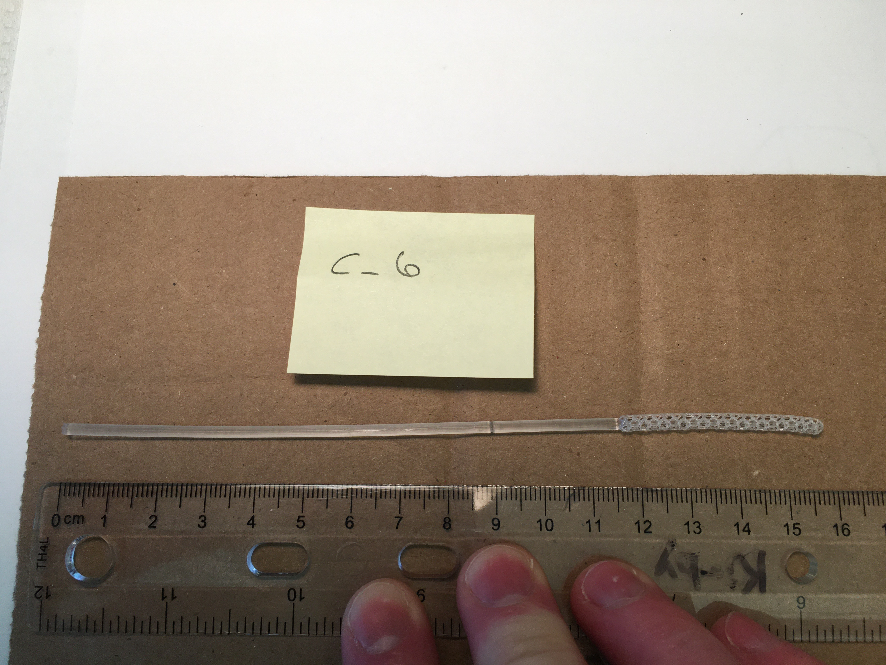
Carbon "C-6" (left) and Carbon "C-7"

The empty structure collects sufficient specimen. The central spine of the tip provides sufficient rigidity and flexibility. The longer tip provides similar or greater flexibility than the thin neck. The material is not autoclavable but does tolerate alcohol disinfection.

We reiterate that we consider many <a href="#tip">tip designs</a> as passable.

<!--

### Notable performers, shaft-glue-flock

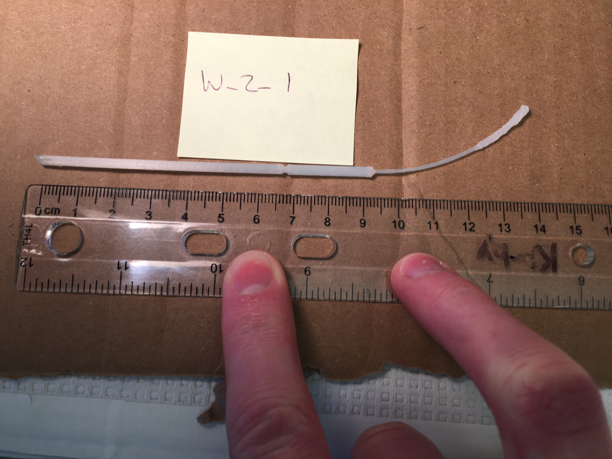
Wyss "W_2_1"

This swab best approximated commercially available swabs, but there is concern over manufacturing variability, as can be appreciated by the picture above. In general we prefer all-in-one models for potential for mass production.
-->

### Contact

Please contact jennifer.kritz@bilh.org for press inquiries.

Please contact Dr. Ramy Arnaout, MD, DPhil rarnaout@bidmc.harvard.edu for technical/clinical issues, and Cody Callahan ccallah4@bidmc.harvard.edu for everything else (including coordinating deliveries/testing).

## Wednesday, March 25, 2020

This document summarizes BIDMC's evaluation of dozens of [**geometries**](#geometries) (swab designs) and [**materials**](#materials) ([full data here](np_swab_results.xlsx)), with brief comments on [**decontamination/sterilization** and **packaging**](#decon), [**production volume**](#volume), and [**clinical trials**](#trials).

- <a href = "#geometries">Geometries</a>
- <a href = "#materials">Materials</a>
- <a href = "#decon">Decontamination/sterilization and packaging</a>
- <a href = "#volume">Production volume</a>
- <a href = "#trials">Clinical trials</a>
- <a href = "#contact">Contact</a>

## Geometries

**Note:** examples shown are not necessarily the preferred material and not necessarily from the manufacturer who created the design. No attribution of credit is made or implied by this listing.

### Tip

Tip should:

- collect sufficient material (see Gram stains below)
- not end in a sharp tip (e.g., spring geometry ends in sharp tip; if tip is connected to support regardless of geometry, result is a sharp tip)
- maximize surface area
- be flexible (more flexible than bic pen)
- restore elastically to straight (even after multiple bending)

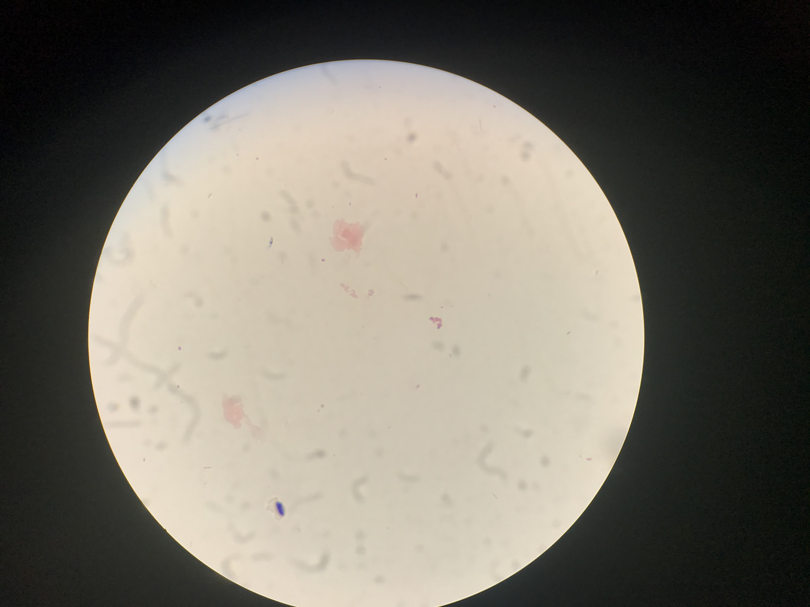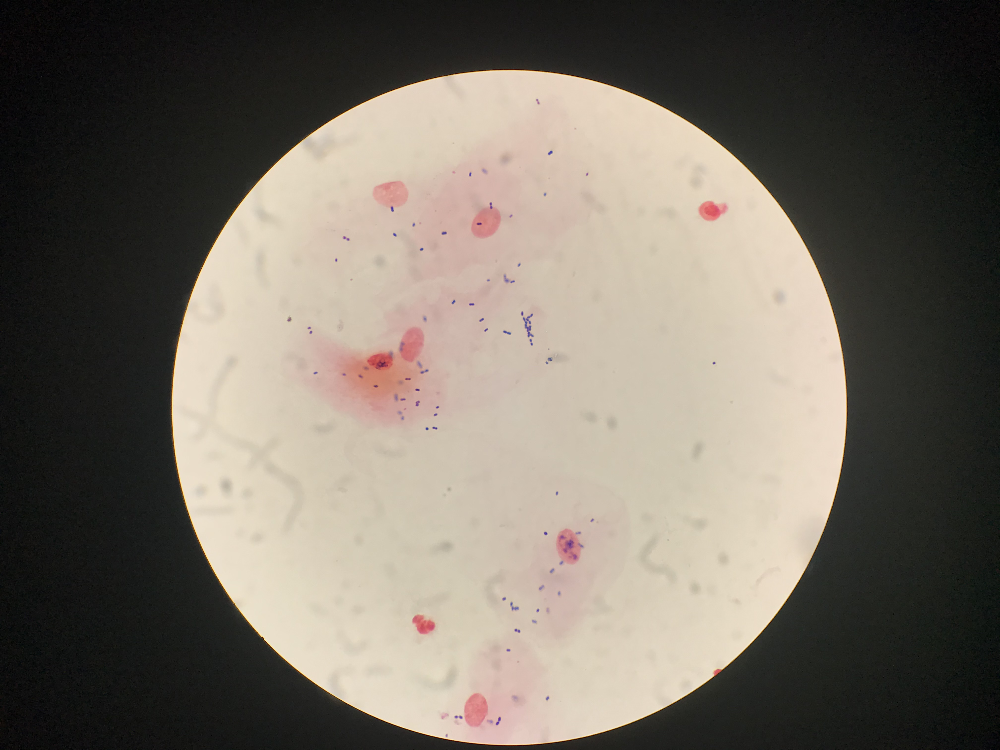

Reference (left) and passing-quality (right) Gram stains of cheek swabs. Epithelial cells (large faint pink) and (Gram-positive) bacteria (small purple) are clearly seen. Many Gram stains of the prototype NP swabs under evaluation (like the one at right) collected more material than the reference (left), but this should not be interpreted quantitatively (a lot/a little), only qualitatively (yes/no).

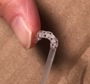

Tip flexibility

#### Preferred tip:

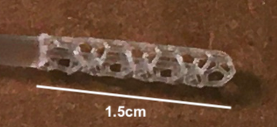

Hexagon (Carbon3D)

This was preferred because the hollowness captured a lot of material, while also being reasonably stiff. This was not a strong preference.

#### Also acceptable (no order):

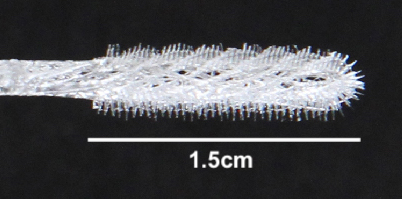

Bristle (OPT)

Honeydipper (FormLabs)

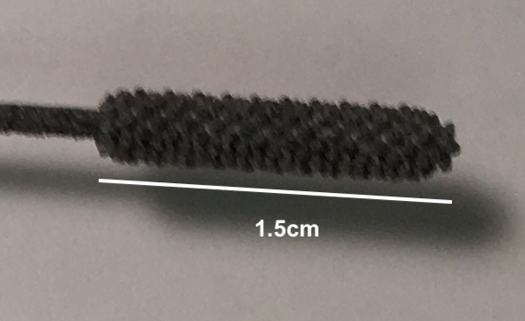

Cattail (HP print of ?USF design)

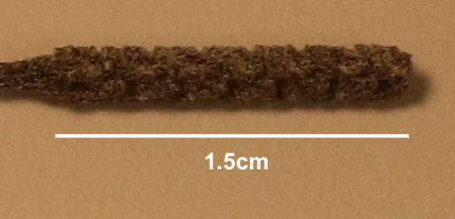

Brush (HP print of ?USF design)

Note none of these are [flocked]("https://github.com/HMS-RIC/Covid19-NP-Swab/#flock"). FDA says flock is **preferred** but **not required**.

### Shaft

#### Preferred shaft:

3mm-diameter tip, 1mm-diameter neck, 2.5mm-dimater handle and \~2mm breakpoint located 7cm from tip-end of swab.

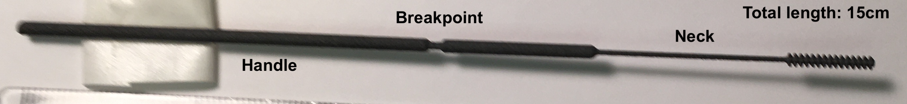

Archetypal (Abiogenix design (?), HP print)

### STL files

We do not have all stl files for all designs tested; what we have are [here](../design_files/). If you need one we don't have, please contact its [creator](np_swab_results.xlsx)). If you have an stl file to share, please email it to ccallah@bidmc.harvard.edu with *STL-FILE_\<identifier>_\<company>* in the subject field.

## Materials

### Handling

Key features (best performers in parentheses):

- straight (HP > Carbon3D, FormLabs)
- smooth to the touch (Carbon3D > FormLabs, HP)
- dry (not sticky) (Carbon3D, HP, FormLabs)
- shaft: stiffness comparable to that of the inkholder of a bic pen
- neck and tip: flexible (capable of being bent 180 degrees without breaking, except at the breakopint) (HP, Carbon3D)
- breaks at breakpoint (should be somewhat difficult to do) (HP, FormLabs)
- no dust or other byproduct of printing process

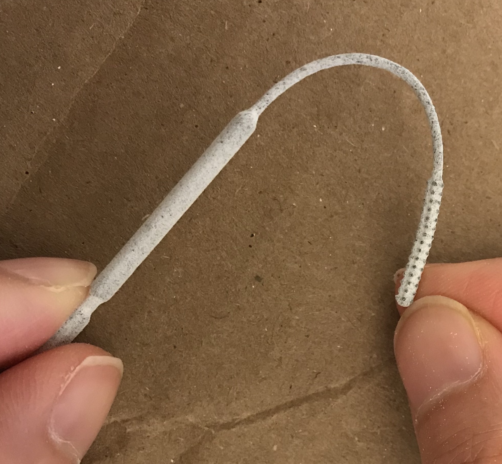

Neck flexibility

#### Preferred material:

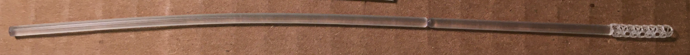

Keysplint Soft (Carbon3D)

### PCR compatibility

All materials tested so far (as of March 25, 2020) are PCR compatibile (see Excel for any codenames).

**Passed:** OPT, HP ("USF-1"), EnvisionTec (Nilson), FormLabs, Carbon3D, Pavel.

**Pending:** J_1 (Jifei), USF-2, B_1, S_1 (Seriano), EV.

**Not tested (failed clinical testing):** FT

**Not listed here:** materials from compound manufacturing (shaft plus glue plut flock/PDMS)

## Decontamination/sterilization and packaging

Autoclaving preferable, isopropanol or 70% ethanol washes with clean packaging acceptable.

Likely process: swabs produced and washed at scale, then:

- (option 1) take to a company with autoclavable paper packaging (e.g. Georgia-Pacific, 3M), or

- (option 2) packaged at manufacturer's site (e.g. EnvisionTec)

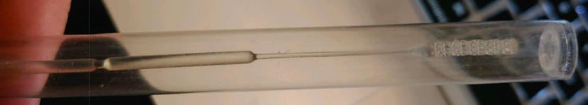

EnvisionTec's packaging

## Production volume

To my knowledge EnvisionTec, HP, FormLabs, and Carbon3D all have capacity for producing at least hundreds of thousands per day.

## Field testing, safety, market

**Field testing.** Field testing means using swabs on nasopharynx of people with confirmed SARS-CoV-2.

At BIDMC we have tested for appropriateness by (infectious disease/clinical pathologist) expert evaluation, and tested for sufficiency of collection using cheek swab and Gram stain as a surrogate for viral particle collection from nasopharynx. We have **not** field tested.

Field testing requires IRB approval.

To my knowledge Dr. Summer Decker at USF has field-tested at least on non COVID-19-suspected cases. She has an IRB.

I suggest as a first step other clinical sites model after USF's IRB and have their local IRBs cede review to USF as URB of record.

**Safety.** Note swabs are FDA Class-1 exempt devices; "garage testing" not advised.

**Market.** Several tip/shaft/material combinations will likely yield usable products. There will be a competitive market. A/B testing, marketing, contracting, etc. are beyond the scope of this document.

## Contact

Ramy Arnaout, MD, DPhil rarnaout@bidmc.harvard.edu 617-538-5681 on behalf of the BIDMC team (not everyone is pictured):

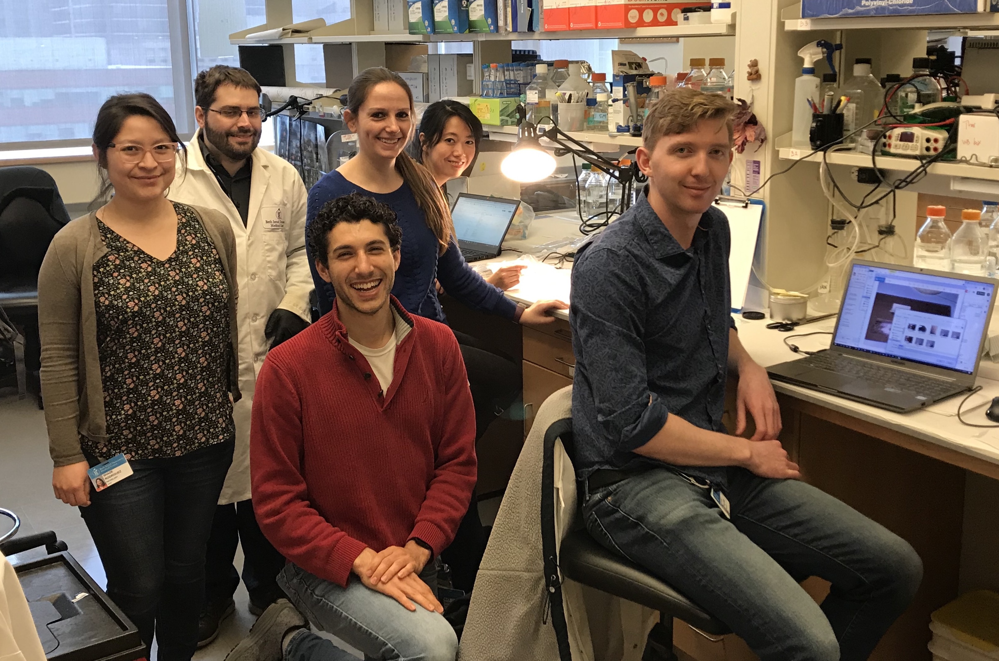
